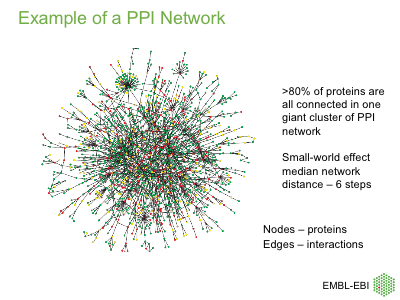

```{css}
.exercise {
  background:#FDFDF1; border:1px solid darkgrey;
  border-radius: 5px; padding-top:10px;
  padding-bottom:10px; padding-left:5px;
  padding-right:5px; margin-top: 5px;
  margin-bottom: 20px;
}
code {color: inherit; background-color: rgba(0, 0, 0, 0.08);}
div.sourceCode {
  margin-top: 0.5em;
  margin-bottom: 0.5em;
}
h4 {
  font-weight: bold;
  font-size: larger;
  margin-top: 20px;
}
```

# {.tabset}
## Intro {.tabset}
### Relevance
Studying the interactions between cellular molecules is a key aspect of understanding cellular life.

Importantly, _**protein-protein interactions and protein-compound interactions are critical targets for therapeutic drugs**_.

Work on protein-protein interactions is part of the field of **network analysis**, which has its own specialised tools, vocabulary and mathematics.  

```{r, Slide1, fig.width=8}

```


### Types  
#### Types of biological interactions  

* Physical protein-protein interactions [[IntAct](https://www.ebi.ac.uk/intact); [String](https://string-db.org)].  
   - direct.  
   - indirect.  
   - stable.  
   - not stable (e.g. receptor/ligand, enzyme/substrate).  
* Metabolic pathways [[Reactome](https://reactome.org/); [KEGG](https://www.genome.jp/kegg/)].  
* Signaling pathways [[Reactome](https://reactome.org/)].  
* Protein-compound interactions.  
* Gene regulatory networks [[GeneCan](http://genecan.sgul.ac.uk/); [Xena](https://xenabrowser.net/)].  
* Genetic interaction networks.  


## Online resources {.tabset}
### NCBI Gene
#### NCBI Gene

A quick way of looking up proteins interacting with a given gene product.

The [NCBI Gene database](https://www.ncbi.nlm.nih.gov/gene/) can be accessed indirectly through the same interface as [Pubmed](www.pubmed.gov) by choosing "Gene" from the dropdown menu.  

The the page for a particular gene, search for the section headed 'Interactions'. Here you find a table, often very long, that lists all proteins that are known to interact with the protein encoded by the current gene.

Unfortunately, there is no way to sort the table and no button that would allow us to download the data for closer inspection.


### GeneCards
#### GeneCards  
https://www.genecards.org/  

When searching Google for a gene symbol, its [GeneCards](https://www.genecards.org/) page often appears near the top of the list.  

Scroll down to the section on 'Pathways / Interacting proteins'. Clicking on the network plot takes you directly to the [String database](https://string-db.org).


### String
#### String database
https://string-db.org.  
Excellent resource to look up protein interaction networks interactively on the web.

Part of the _**European Life-Sciences Infrastructure for Biological Information (ELIXIR)**_.


### EBI Intact
#### EBI Intact

EBI IntAct is also an ELIXIR project.

https://www.ebi.ac.uk/intact/home


## PPI in R {.tabset}
### Setup
```{r, Setup, include=FALSE}
knitr::opts_chunk$set(message=FALSE, warning=FALSE)
```

Clear memory ...  
```{r clear-memory}
rm(list=ls(all=T)) # clear memory
cat("\014") # clear console
```

Load packages ...  
```{r, Packages, results="hide", message=FALSE, include=TRUE}
if (!requireNamespace("magrittr")) install.packages("magrittr")
if (!requireNamespace("dplyr")) install.packages("dplyr")
if (!requireNamespace("readr")) install.packages("readr")
if (!requireNamespace("ggplot2")) install.packages("ggplot2")
if (!requireNamespace("GGally")) install.packages("GGally")
if (!requireNamespace("scales")) install.packages("scales")
if (!requireNamespace("rstudioapi")) install.packages("rstudioapi")
if (!requireNamespace("network")) install.packages("network")
if (!requireNamespace("sna")) install.packages("sna")
if (!requireNamespace("statnet.common")) install.packages("statnet.common")
if (!requireNamespace("DT")) install.packages("DT")
if (!requireNamespace("pander")) install.packages("pander")

library(magrittr)
library(dplyr)
library(readr)
library(GGally)
library(scales)
library(network)
library(sna)
library(ggplot2)
```

### Load IntAct database
#### Load the the IntAct PPI database (2016 version)

```{r load-data, results="hide"}
file.hu <- "data/intact_human_genesymbols_2016_08_11.txt"
stopifnot(file.exists(file.hu))
df1 <- as.data.frame(readr::read_tsv(file=file.hu, col_names = TRUE, comment = "#"))
cat("Number of rows: ", nrow(df1), "\n",
    "Number of columns: ", ncol(df1), sep="")
```

Print first six rows:
```{r print-df1}
head(df1)
```

Remove columns 3 and 4 (print first 10 rows):
```{r}
df2 <- df1 %>% 
  select(1:2) %>% 
  set_colnames(c("p1", "p2")) %>% 
  arrange(p1)
head(df2, 10)
```

### Select YFG
#### PPI for 'your favorite gene' (YFG). 

```{r define-yfg}
yfg <- "CASC5"
cat("YFG:", yfg)
```

Data frame dimensions:
```{r filter-on-yfg}
df.yfg <- df2 %>% 
  filter(p1 == yfg) %>% 
  distinct %>% 
  arrange(p1, p2)
dim(df.yfg)
```

Print data frame where first column matches YFG:
```{r print-df-yfg}
df.yfg
```

```{r get-ppi-vector}
partners <- subset(df2, p1==yfg, select="p2", drop=T)
partners <- c(yfg, sort(partners))
cat("Number of PPI 'partners':", length(partners))
```

Print interacting proteins:
```{r print-partners}
cat(partners, sep=", ")
```

Now select all combinations between all 'partners'. This generates our **'network'**.
```{r all-partner-interactions}
df.net <- df2 %>% 
  filter(p1 %in% partners) %>% 
  filter(p2 %in% partners) %>% 
  filter(! p1 == p2) %>% 
  distinct(.) %>% 
  arrange(p1, p2) %>% 
  set_rownames(NULL)
```


New data frame dimensions:
```{r print-network-dim}
cat(paste(dim(df.net), c("rows,", "columns"))) # 160   2
```

Print network data frame:
```{r print-network-df}
DT::datatable(df.net, rownames = FALSE)
```

### Plot
#### Plot network

Generate 'network' data object using the `network` package
```{r}
head(df.net, 13)
```


```{r get-network-object}
yfg.net <- network::network(x=df.net, directed=TRUE)
# yfg.net
cat("Data class:", class(yfg.net))
```


```{r plot1, message=FALSE, warning=FALSE}
print(ggnet2(yfg.net, label = TRUE, size = "degree")) # , layout.exp=1
```

## Session info
```{r print-date-and-time}
cat(format(Sys.time(), format = "%a %d-%b-%Y %Rh"))
```

```{r print_session_info, results="asis"}
pander::pander(sessionInfo(), compact = FALSE)
```

